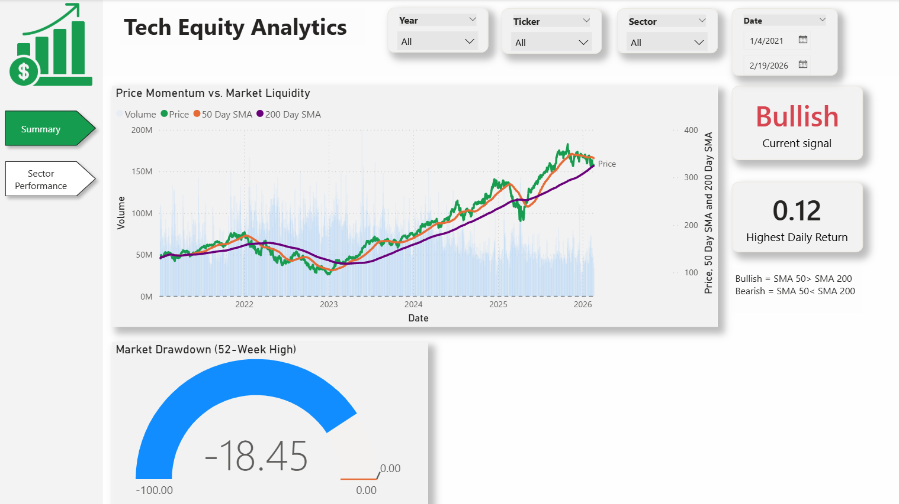

Tech Equity Analytics Pipeline

A robust ETL (Extract, Transform, Load) pipeline designed for tracking, analyzing, and visualizing the performance of the top 10 technology stocks.

Executive Summary

This project automates the end-to-end data lifecycle for high-growth tech equities. The pipeline bridges the gap between raw market data and actionable technical insights through a metadata-driven architecture. 

Tech Stack

Data Source: yfinance API (Python) for historical and real-time market data

Storage: PostgreSQL (Local Server)

Logic: SQL Views & CTEs (Window Functions)

Visualization: Power BI

DevOps: Git/GitHub for version control

Database Architecture & Data Modeling

To ensure clean data and high-performance reporting, the database utilizes a layered architecture:

raw_stocks_data (Table): Contains raw historical price and volume data.

ticker_metadata (Table): Stores company names and sectors for tickers. 

v_stock_analysis (View): A complex SQL view that joins the metadata and raw_stocks tables and serves as an optimized data source for Power BI.

Key Analytical Features & SQL Logic

This pipeline performs advanced technical analysis within the database to ensure high performance and scalability:

Moving Average Crossovers: Calculates 50-day and 200-day Simple Moving Averages (SMA) to generate Bullish and Bearish trend signals.

Volatility & Momentum Metrics: Tracks daily return percentages and the proximity of the current price to the 52-week high to identify breakout potential.

Advanced SQL Window Functions: Uses LAG, AVG() OVER, and MAX() OVER within Common Table Expressions (CTEs) for seamless time-series analysis.

Session Management: Utilizes automated logic to terminate active database backends and resolve table locks during data refreshes.

Dashboard Analysis & Insights

The Power BI dashboard is structured into two specialized views: 

Page 1: Executive Market Overview

Sector Sentiment: High-level performance tracking vs. sector averages.

Volatility Tracking: Insights into which stocks are currently trading at a significant discount from their 52-week highs, identifying potential "buy-the-dip" opportunities.

Volume Analysis: Correlates price spikes with abnormal trading volume.

Page 2: Technical Deep-Dive

Trend Signaling: Visualizes the relationship between the 50-day and 200-day SMAs.

Golden Cross Detection: Highlights long-term momentum shifts.

Price Action Context: Granular view of price movement against historical supports.

#### Dashboard Preview

| Executive Overview | Technical Deep-Dive |
| :--- | :--- |
|  |  |

Repository Structure

stock_analysis.py: Main ETL script with automated schema provisioning and metadata seeding.

Tech Stocks.pbix: Interactive Power BI dashboard.

requirements.txt: Python dependencies.

.env.example: Template for local environment configuration.

Setup & Installation

Clone the Repository: git clone https://github.com/Rosembinya/Tech-Equity-Analytics.git

Install Dependencies: pip install -r requirements.txt

Configure Environment: Rename .env.example to .env and provide your local PostgreSQL credentials.
